# Maven Roasters Coffee Shop Sales Dashboard

<table>
  <tr>
    <td width="70%">
      <h2>Maven Roasters Sales & Operations Case Study</h2>
      

        Excel-based retail analytics project analyzing coffee shop transaction data to uncover revenue trends,
        peak demand periods, product performance, and store-level opportunities across three New York City locations.
      

      

        The goal was to transform raw sales data into a business-facing dashboard that a franchise owner could use
        to make better decisions around staffing, promotions, inventory, and product strategy.
      

    </td>
    <td width="30%">
      <table>
        <tr>
          <td><b>Tool</b></td>
          <td>Microsoft Excel</td>
        </tr>
        <tr>
          <td><b>Dataset</b></td>
          <td>Coffee Shop Sales.xlsx</td>
        </tr>
        <tr>
          <td><b>Period</b></td>
          <td>Jan–Jun 2023</td>
        </tr>
        <tr>
          <td><b>Transactions</b></td>
          <td>149K</td>
        </tr>
        <tr>
          <td><b>Revenue</b></td>
          <td>$699K</td>
        </tr>
      </table>
    </td>
  </tr>
</table>

  
  
  
  

---

## Dashboard Preview

  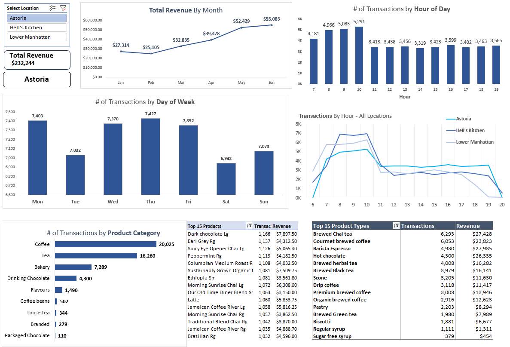

> This dashboard summarizes revenue, transaction volume, monthly sales trends, hourly demand patterns, and product performance across Maven Roasters’ three store locations.

---

## Project Background

Maven Roasters is a coffee shop chain with three locations in New York City: **Astoria, Hell’s Kitchen, and Lower Manhattan**. The business collected transaction-level sales data from January through June 2023 to better understand purchase behavior and streamline operations.

This project analyzes the dataset in **Microsoft Excel** using calculated fields, PivotTables, PivotCharts, and a dynamic dashboard. The analysis is designed for a franchise owner or operations leader who needs a clear view of store performance and actionable opportunities.

The business questions guiding the analysis were:

1. Which locations generate the most revenue?
2. How does revenue trend month over month?
3. Which days and hours have the highest customer demand?
4. Which product categories and product types perform best?
5. Where can Maven Roasters improve staffing, promotions, and product strategy?

---

## Executive Summary

Maven Roasters generated approximately **$699K in revenue from 149K transactions** between January and June 2023. Revenue was evenly distributed across the three locations, with Hell’s Kitchen contributing **33.84%**, Astoria contributing **33.23%**, and Lower Manhattan contributing **32.92%** of total revenue.

Customer demand is heavily concentrated in the morning, with the strongest activity occurring between **7 AM and 10 AM**. After 10 AM, transaction volume drops sharply, creating a clear opportunity to improve mid-day and afternoon sales through targeted offers.

Tea, coffee, and espresso are the strongest product categories across the business. Several low-volume products contribute less than **0.1%** of transaction share in certain locations, suggesting an opportunity to review the menu and reduce inventory complexity.

---

## Key Business Metrics

| Metric | Description | Business Relevance |
|---|---|---|
| **Total Revenue** | Total sales generated from all transactions | Measures overall business performance |
| **Transaction Volume** | Count of completed transactions | Measures customer demand and store traffic |
| **Revenue by Location** | Revenue split across the three stores | Compares store-level performance |
| **Monthly Revenue Trend** | Revenue by month from January to June | Identifies growth patterns and slow periods |
| **Hourly Transaction Trend** | Transaction volume by hour of day | Supports staffing and operational planning |
| **Product Performance** | Transaction volume by product category and type | Supports inventory, menu, and promotion decisions |

---

## Data Structure Overview

The dataset contains approximately **149K transaction records** from Maven Roasters between **January and June 2023**.

Each row represents one transaction and includes transaction timing, store location, product information, quantity purchased, unit price, and calculated revenue.

| Field | Description |
|---|---|
| **transaction_id** | Unique transaction identifier |
| **transaction_date** | Date of transaction |
| **transaction_time** | Time of transaction |
| **transaction_qty** | Quantity purchased |
| **store_id** | Store identifier |
| **store_location** | Store where the transaction occurred |
| **product_id** | Product identifier |
| **unit_price** | Price per item |
| **product_category** | Product grouping, such as coffee, tea, or bakery |
| **product_type** | Specific product type |
| **product_detail** | Detailed product name or size |
| **Revenue** | Calculated revenue from quantity and unit price |
| **Month / Month Name** | Month extracted from transaction date |
| **Weekday** | Day of week extracted from transaction date |
| **Hour** | Hour extracted from transaction time |

---

## Excel Workflow

This project was completed entirely in **Microsoft Excel**.

| Excel Step | Purpose |
|---|---|
| **Data Review** | Checked transaction-level data for structure, consistency, and completeness |
| **Calculated Fields** | Created revenue, month, weekday, and hour fields |
| **PivotTables** | Summarized revenue and transactions by location, month, hour, day, and product |
| **PivotCharts** | Built visual summaries of sales trends, traffic patterns, and product performance |
| **Dashboard Design** | Created a business-facing dashboard for decision-making |
| **Insight Development** | Translated Excel outputs into operational recommendations |

---

## Excel Skills Demonstrated

| Skill | How It Was Used |
|---|---|
| **Calculated Columns** | Created revenue, month, weekday, and hour fields from the original transaction data |
| **PivotTables** | Summarized revenue and transaction volume by store, product, month, day, and hour |
| **PivotCharts** | Visualized revenue trends, hourly demand, and product performance |
| **Dashboard Layout** | Designed an executive-facing dashboard for business users |
| **Data Storytelling** | Connected sales patterns to staffing, promotion, inventory, and product decisions |
| **Business Reporting** | Communicated findings through an executive summary, insights, recommendations, and caveats |

---

# Insights Deep Dive

---

## 1. Revenue Is Balanced Across All Three Locations

### Observation

| Location | Revenue | Revenue Share |
|---|---:|---:|
| **Hell’s Kitchen** | **$236,511** | **33.84%** |
| **Astoria** | **$232,243** | **33.23%** |
| **Lower Manhattan** | **$230,057** | **32.92%** |

### Business Context

Revenue is distributed almost evenly across the three store locations. Hell’s Kitchen leads slightly, but the gap between locations is small enough that no single store appears to be materially underperforming.

### Impact

The strongest opportunity is not fixing one weak location. Instead, Maven Roasters should optimize each store’s operating patterns, especially around staffing, peak-hour demand, and product mix.

  <b>Total Revenue by Month</b>

<table align="center">
  <tr>
    <td align="center">
      <b>Hell's Kitchen</b> 
      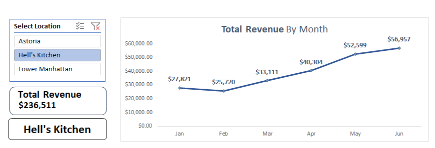
    </td>
    <td align="center">
      <b>Astoria</b> 
      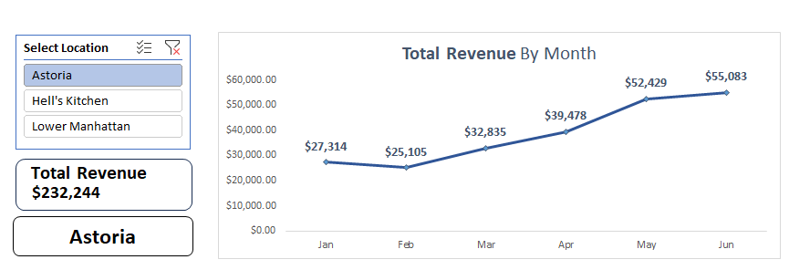
    </td>
  </tr>
  <tr>
    <td colspan="2" align="center">
      <b>Lower Manhattan</b> 
      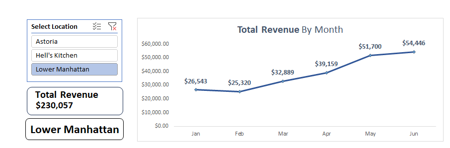
    </td>
  </tr>
</table>

---

## 2. February Was the Weakest Revenue Month Across Locations

### Observation

All three locations experienced a revenue decline in February:

| Location | February Revenue Change |
|---|---:|
| **Astoria** | **-8.09%** |
| **Hell’s Kitchen** | **-7.55%** |
| **Lower Manhattan** | **-4.61%** |

Revenue recovered strongly in March, with all locations increasing approximately **28% to 31%**. May was the strongest growth month, with approximately **30% to 32%** growth across stores.

### Business Context

Because all three locations declined in February, the drop appears to be business-wide rather than store-specific. Potential causes may include seasonality, weather, fewer operating days, reduced commuter activity, or lack of promotional support.

### Impact

Maven Roasters should treat February as a risk period and plan in advance. A seasonal campaign, loyalty push, or mid-day promotion could help reduce the impact of slower customer traffic.

  <b>Monthly Revenue Performance Table</b>

  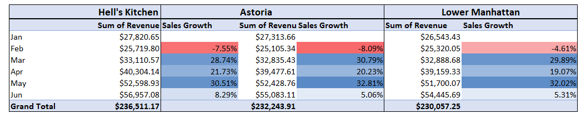

---

## 3. Morning Hours Drive the Majority of Demand

### Observation

Transaction volume increases sharply during the morning rush, especially around **7 AM**.

| Location | Morning Surge |
|---|---:|
| **Hell’s Kitchen** | **+105.1%** |
| **Lower Manhattan** | **+98.5%** |
| **Astoria** | **+18.8% from 7 AM to 8 AM** |

After 10 AM, transaction volume declines significantly. The sharpest mid-day drops occur around 11 AM:

| Location | Sharpest Mid-Day Drop |
|---|---:|
| **Lower Manhattan** | **-56.2%** |
| **Hell’s Kitchen** | **-48.3%** |

### Business Context

Maven Roasters is highly dependent on morning commuter traffic. This is common for coffee shops, but the sharp decline after 10 AM indicates unused revenue capacity later in the day.

### Impact

The business should prioritize the **7 AM to 10 AM** window for staffing, product readiness, and service speed. The post-10 AM decline should be addressed through targeted mid-day promotions.

---

## 4. Core Beverages Drive Product Performance

### Observation

Tea, coffee, and espresso are the strongest product categories across all three stores.

Key findings:

- **Brewed Chai Tea** is Astoria’s top-selling product type, with **6,293 transactions**
- **Espresso** is the top-selling product type in Hell’s Kitchen and Lower Manhattan
- Several low-volume products contribute less than **0.1%** of transaction share in certain locations

### Business Context

The strongest-performing products align with Maven Roasters’ core café identity. However, very low-volume products may create unnecessary inventory and menu complexity.

### Impact

Top-performing beverages should be used in promotions and bundles. Low-performing items should be reviewed to determine whether they should be promoted, replaced, or removed.

  <b>Top 15 Product Types by Location</b>

<table align="center">
  <tr>
    <td align="center">
      <b>Hell's Kitchen</b> 
      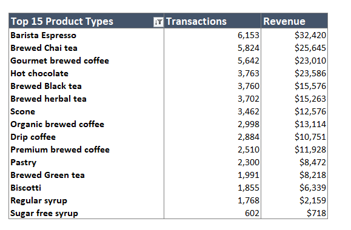
    </td>
    <td align="center">
      <b>Astoria</b> 
      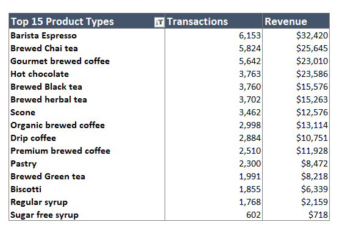
    </td>
  </tr>
  <tr>
    <td colspan="2" align="center">
      <b>Lower Manhattan</b> 
      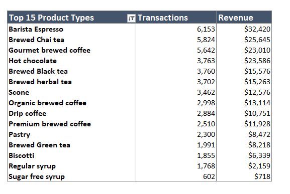
    </td>
  </tr>
</table>

  <b>Bottom 15 Product Types by Location</b>

<table align="center">
  <tr>
    <td align="center">
      <b>Hell's Kitchen</b> 
      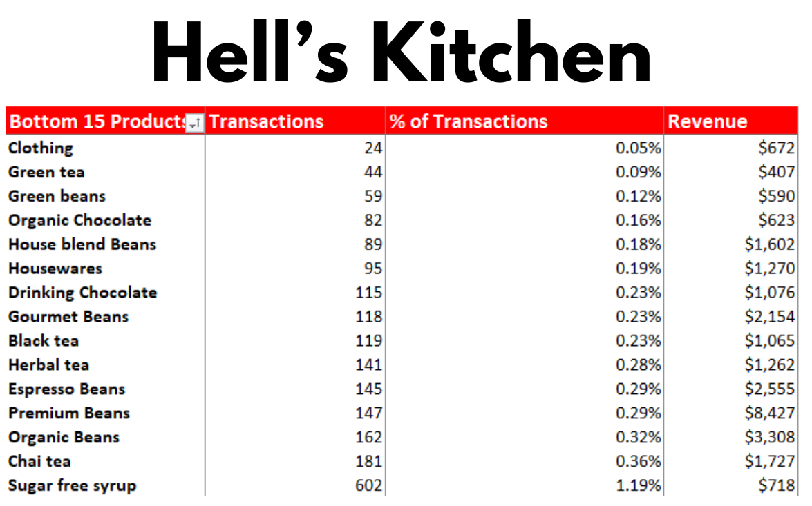
    </td>
    <td align="center">
      <b>Astoria</b> 
      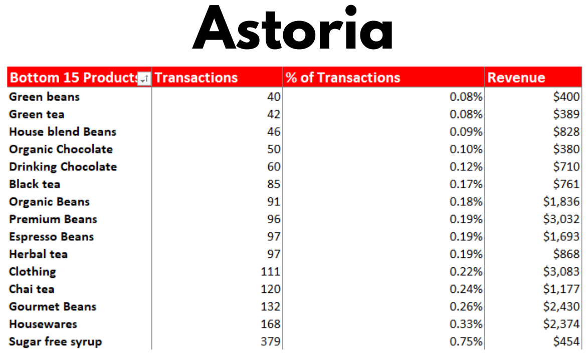
    </td>
  </tr>
  <tr>
    <td colspan="2" align="center">
      <b>Lower Manhattan</b> 
      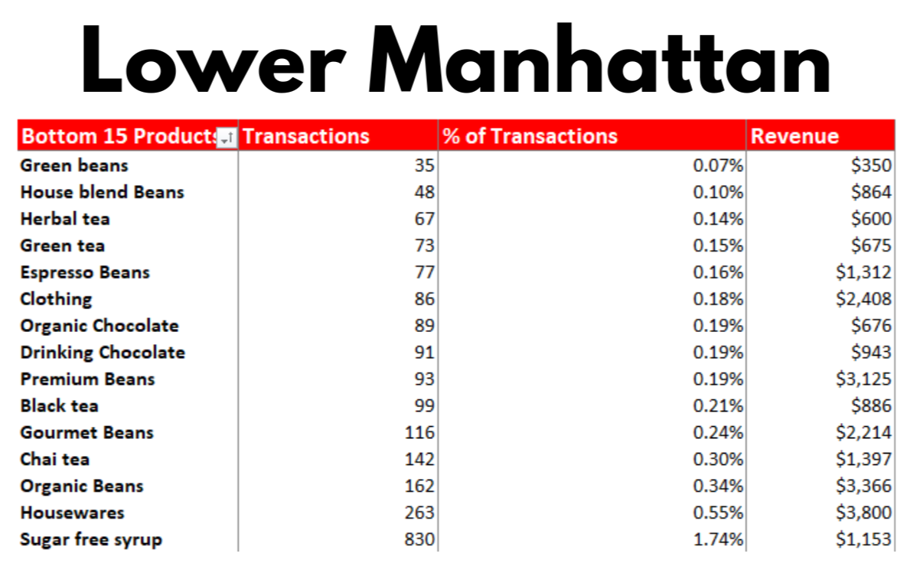
    </td>
  </tr>
</table>

---

# Strategic Recommendations

---

## 1. Optimize Staffing Around the Morning Rush

Transaction volume is strongest between **7 AM and 10 AM**, making this the most important operating window across all locations.

### Recommended Actions

- Increase staffing coverage before the morning rush begins
- Prepare high-demand beverages before peak traffic
- Monitor transactions per hour to evaluate whether staffing matches demand
- Prioritize faster service during the highest-volume hours

### Success Metrics

| Metric | Why It Matters |
|---|---|
| **Transactions per hour from 7 AM–10 AM** | Measures whether the store is handling peak demand efficiently |
| **Average wait time during peak hours** | Tracks whether staffing improvements are improving customer experience |
| **Sales per labor hour** | Measures whether staffing levels are aligned with revenue productivity |
| **Customer complaints or service delays** | Helps identify whether peak-hour bottlenecks are improving |

### Business Impact

Better staffing alignment can reduce wait times, improve customer experience, and protect revenue during the most important sales window of the day.

---

## 2. Launch Targeted Off-Peak Promotions

Transaction volume declines sharply after 10 AM, creating an opportunity to increase mid-day and afternoon sales.

### Recommended Actions

- Test tea-and-pastry bundles between **11 AM and 3 PM**
- Promote espresso drink upgrades after the morning rush
- Use loyalty incentives for afternoon visits
- Compare transaction volume before and after each promotion

### Success Metrics

| Metric | Why It Matters |
|---|---|
| **Revenue lift from 11 AM–3 PM** | Measures whether promotions improve off-peak sales |
| **Transaction lift from 11 AM–3 PM** | Shows whether promotions increase customer traffic |
| **Average order value** | Tracks whether bundles increase spend per transaction |
| **Promotion redemption rate** | Measures whether customers are responding to the offer |

### Business Impact

A focused off-peak strategy can help Maven Roasters increase revenue without relying only on morning commuter traffic.

---

## 3. Review Low-Performing Products

Products contributing less than **0.1%** of transaction share should be reviewed for business value.

### Recommended Actions

- Reposition low-performing items on the menu
- Test limited-time promotions to validate demand
- Replace weak products with stronger alternatives
- Remove products that create inventory complexity without meaningful sales contribution

### Success Metrics

| Metric | Why It Matters |
|---|---|
| **Product transaction share** | Measures whether low-performing products are gaining or losing demand |
| **Product revenue contribution** | Shows whether products contribute meaningful sales value |
| **Inventory turnover** | Tracks whether items are moving efficiently through stock |
| **Waste or spoilage rate** | Identifies products that may create unnecessary operating cost |

### Business Impact

Product rationalization can simplify inventory planning, reduce operational complexity, and allow more focus on products that customers consistently purchase.

---

## Caveats and Assumptions

| Limitation | Why It Matters |
|---|---|
| **The dataset only covers January through June 2023.** | The analysis cannot fully account for annual seasonality or holiday demand. |
| **Product performance was evaluated by transaction volume.** | High transaction count does not necessarily mean highest profitability. |
| **Promotional data was not included.** | Sales changes cannot be directly tied to discounts, campaigns, or marketing activity. |
| **Labor data was not included.** | Staffing recommendations are based on demand patterns, not actual labor cost. |
| **Store hours were inferred from transaction activity.** | Blank transaction periods may reflect operating hours, but store schedule data would confirm this. |

---

## Tool Used

| Tool | Purpose |
|---|---|
| **Microsoft Excel** | Data cleaning, calculated fields, PivotTables, PivotCharts, dashboard design, and business reporting |

---

## Business Impact

This dashboard gives Maven Roasters a clear view of store performance, customer demand patterns, and product-level opportunities.

The analysis supports business decisions in five areas:

| Business Area | Impact |
|---|---|
| **Staffing** | Align labor coverage with peak customer demand |
| **Revenue Growth** | Identify opportunities to increase off-peak sales |
| **Product Strategy** | Focus promotions and inventory decisions on stronger products |
| **Operations** | Reduce complexity from low-performing products |
| **Executive Reporting** | Provide franchise owners with a clear, repeatable performance dashboard |

---

## Portfolio Rating

**8.8 / 10**

This project demonstrates Excel-based analytics, business problem framing, dashboard design, KPI development, and stakeholder-ready recommendations. The strongest elements are the executive summary, insight structure, and practical recommendations tied to staffing, promotions, and product strategy.
